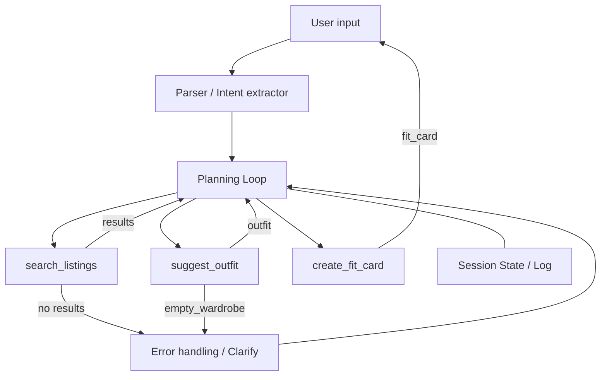

# FitFindr — planning.md

> Complete this document before writing any implementation code.
> Your spec and agent diagram are what you'll use to direct AI tools (Claude, Copilot, etc.) to generate your implementation — the more specific they are, the more useful the generated code will be.
> Your planning.md will be reviewed as part of your submission.
> Update it before starting any stretch features.

---

## Tools

List every tool your agent will use. For each tool, fill in all four fields.
You must have at least 3 tools. The three required tools are listed — add any additional tools below them.

### Tool 1: search_listings

**What it does:**
Searches the local listings dataset for items that match free-text descriptions and filters (size, price, tags). It returns sorted candidate listings that satisfy the user's constraints.

**Input parameters:**
- `description` (str): Free-text description or keywords (e.g., "vintage graphic tee").
- `size` (str, optional): Size filter (e.g., "M", "L"); empty means no size filter.
- `max_price` (float, optional): Maximum price; omit or null for no price limit.
- `sort_by` (str, optional): How to order results (e.g., `price`, `relevance`, `newest`).

**What it returns:**
A list of listing objects (possibly empty). Each listing contains at least: `id` (str), `title` (str), `price` (float), `size` (str), `tags` (list[str]), `image_url` (str), `source_url` (str), and a short `description` (str).

**What happens if it fails or returns nothing:**
If the function returns an empty list the agent informs the user that no exact matches were found and offers to broaden filters (raise `max_price`, remove size constraint, or search similar keywords). On error (I/O, parsing), the agent logs the failure, returns an explanatory message to the user, and offers to retry.

---

### Tool 2: suggest_outfit

**What it does:**
Given a new item and the user's wardrobe/profile, suggests one or more complete outfits and a short styling rationale (why the pieces match). It uses simple heuristics (color/season/occasion) and user style preferences.

**Input parameters:**
- `new_item` (dict): A single listing or item to incorporate (same schema as search result).
- `wardrobe` (dict): User's known wardrobe summary (categories, frequently worn items, sizes, style tags). Optional — if absent the tool uses generic suggestions.
- `occasion` (str, optional): Context like `casual`, `work`, `party`.
- `max_items` (int, optional): Max number of outfit suggestions to produce.

**What it returns:**
An `outfit` object containing: `items` (list of item dicts including the `new_item`), `rationale` (str), `confidence` (0-1 float), and optional `swap_suggestions` (list).

**What happens if it fails or returns nothing:**
If the wardrobe is empty or missing, the tool returns `None` with reason `empty_wardrobe`. The agent will then ask the user to provide wardrobe details or fall back to a generic, one-size-fits-most suggestion and clearly label it as such.

---

### Tool 3: create_fit_card

**What it does:**
Formats a combined listing + outfit into a compact, shareable fit card that includes title, image, price, styling bullets, and a CTA. This output is used as the final message to the user and for any UI card rendering.

**Input parameters:**
- `outfit` (dict): The outfit object returned by `suggest_outfit`.
- `listing` (dict, optional): Primary listing metadata to highlight (price, link, image).
- `user_profile` (dict, optional): Data to personalize phrasing (pronouns, preferred formality).

**What it returns:**
`fit_card` (dict) with keys: `title` (str), `hero_image` (str), `price` (float), `bullets` (list[str]), `link` (str), and `meta` (dict with `confidence`, `tags`).

**What happens if it fails or returns nothing:**
If required fields are missing the tool returns an error object describing the missing fields. The agent will fall back to a plain-text summary (title + bullets) and notify the user that card rendering was partial.

---

### Additional Tools

- `load_listings()` — thin wrapper around `utils.data_loader.load_listings()` to read the `data/listings.json` file and return parsed listings. Used by `search_listings`.
- `load_wardrobe(user_id)` — loads a user's saved wardrobe from local storage (or returns empty structure if none). Used by `suggest_outfit`.
- `log_interaction(entry)` — append interaction metadata to a local log for debugging and replay.

---

## Planning Loop

**How does your agent decide which tool to call next?**

1. Parse user input for intent and constraints (keywords, price, size, occasion).
2. If the user requests items or browsing, call `search_listings` with parsed filters.
3. If the user requests styling (explicit or implied by query), call `suggest_outfit` using either the top search result or a user-selected listing.
4. Always call `create_fit_card` to format the final response when a listing + outfit are available.
5. On any failure the planner either (a) asks a clarification question, (b) falls back to a generic suggestion, or (c) offers to broaden search parameters. The loop ends when a final fit card or failure message is returned to the user.

Decision rules / branching:
- If `search_listings` returns > 0: proceed to `suggest_outfit` for top N results (configurable).
- If `search_listings` is empty: propose broadened filters or ask clarifying questions.
- If `suggest_outfit` returns `empty_wardrobe`: ask user for wardrobe details or provide generic styling.

---

## State Management

**How does information from one tool get passed to the next?**

- Session state is a small JSON object stored in memory per conversation consisting of:
     - `user_id` (optional)
     - `wardrobe` (dict) — loaded once per session via `load_wardrobe` when needed
     - `last_search` (dict) — query + filters
     - `candidate_listings` (list[dict]) — results from `search_listings`
     - `selected_listing` (dict) — the listing the user is considering
     - `selected_outfit` (dict) — last outfit generated
     - `conversation_history` (list[str]) — transcripts or brief summaries

- Tools receive only the portion of state they need (e.g., `suggest_outfit` receives `selected_listing` and `wardrobe`). After a tool returns, the planner updates the session state with the result and persists a compact log via `log_interaction`.

---

## Error Handling

For each tool, describe the specific failure mode you're handling and what the agent does in response.

| Tool | Failure mode | Agent response |
|------|-------------|----------------|
| search_listings | No results match the query | Tell user no exact matches; offer broadened filters (higher price, remove size), synonyms, or to save the query for later alerting. |
| search_listings | I/O or parse error | Log error, inform user of temporary issue, and offer to retry. |
| suggest_outfit | Wardrobe is empty or missing | Explain no personalized suggestions are possible; ask user to upload/describe wardrobe or provide generic styling. |
| suggest_outfit | Unable to match complementary items | Return a best-effort outfit with low confidence and explicit fallback suggestions (e.g., "Try pairing with neutral jeans"). |
| create_fit_card | Missing required fields | Fall back to a plain-text summary and inform user the card is partial. |

---

## Architecture

Below is a simple flowchart showing the main components and error branches.

---

## AI Tool Plan

- Implementation approach:
     - Use Claude to generate tool implementations and scaffolding based on the `Tools` specs and Architecture diagram.
     - Validate behavior with unit tests and small runtime checks; iterate until tests pass locally.

- Inputs provided to the code-generation assistant: the `Tools` specs in this file, the `Architecture` diagram, and `utils/data_loader.py` so the assistant can call `load_listings()` correctly.

- Verification: write small unit tests for each tool (three tests for `search_listings` covering match/no-match/error; two tests for `suggest_outfit`; one for `create_fit_card`). Run them locally and inspect outputs.

**Milestone 3 — Individual tool implementations:**
1. Implement `load_listings()` and `search_listings()` using `utils/data_loader.load_listings()`; add tests for price/keyword/size filtering.
2. Implement `load_wardrobe()` and `suggest_outfit()` with fallback generic suggestions; add tests for empty wardrobe and for a small sample wardrobe.
3. Implement `create_fit_card()` formatters and test with a mock outfit.

**Milestone 4 — Planning loop and state management:**
1. Implement the planning loop orchestration (`agent.py` main planner): parsing, calling tools, updating `session_state`, handling errors and clarifications.
2. Add integration tests that simulate the example query in this document and assert the final `fit_card` structure and user-facing messages.
3. Run end-to-end manual checks (try the example query in `app.py` or REPL) and iterate on failure cases.

---

## A Complete Interaction (Step by Step)

Write out what a full user interaction looks like from start to finish — tool call by tool call. Use a specific example query.

**Example user query:** "I'm looking for a vintage graphic tee under $30. I mostly wear baggy jeans and chunky sneakers. What's out there and how would I style it?"

FitFindr needs to interpret the query, call `search_listings` when the user asks for product recommendations, call `suggest_outfit` when a styling recommendation is requested, and finally call `create_fit_card` to format the combined listing and outfit into a shareable response. If `search_listings` returns no matches, the agent should say it found no items and offer to broaden the search; if `suggest_outfit` fails because the wardrobe is empty, it should explain that styling cannot be suggested without wardrobe data.

**Step 1:**
The agent parses the request and calls `search_listings(description="vintage graphic tee", size="", max_price=30.0)` to find available listings under $30.

**Step 2:**
`search_listings` returns one or more matching items. The agent then calls `suggest_outfit(new_item=selected_listing, wardrobe=user_wardrobe)` to build a styling suggestion based on the user’s existing baggy jeans and chunky sneakers preferences.

**Step 3:**
With the returned listing and outfit, the agent calls `create_fit_card(outfit=styling_suggestion)` to assemble the final result into a clear summary card and response text.

**Final output to user:**
The user receives a concise recommendation: a matched vintage graphic tee under $30, a short styling note showing how it pairs with baggy jeans and chunky sneakers, and a formatted fit card summary. If any tool fails, the response explicitly states which stage failed and why, then suggests the next possible action.

command1 Happy Path
I'm looking for a vintage graphic tee under $30. I mostly wear baggy jeans and chunky sneakers. What's out there and how would I style it?

command2
python -c "from tools import search_listings; print(search_listings('designer ballgown', size='XXS', max_price=5))"

command3
python -c "
from tools import search_listings, suggest_outfit
from utils.data_loader import get_example_wardrobe, get_empty_wardrobe
results = search_listings('vintage graphic tee', size=None, max_price=50)
print(suggest_outfit(results[0], get_empty_wardrobe()))
"

Command4
python -c "
from tools import search_listings, create_fit_card
results = search_listings('vintage graphic tee', size=None, max_price=50)
print(create_fit_card('', results[0]))
"
