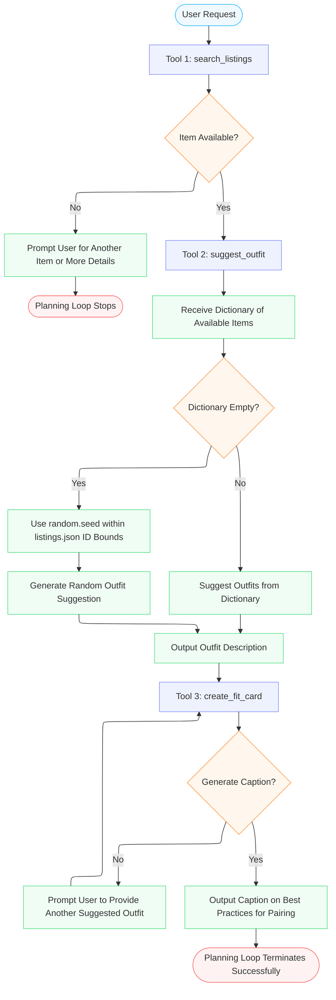

# FitFindr — planning.md

> Complete this document before writing any implementation code.
> Your spec and agent diagram are what you'll use to direct AI tools (Claude, Copilot, etc.) to generate your implementation — the more specific they are, the more useful the generated code will be.
> Your planning.md will be reviewed as part of your submission.
> Update it before starting any stretch features.

---

## Tools

List every tool your agent will use. For each tool, fill in all four fields.
You must have at least 3 tools. The three required tools are listed — add any additional tools below them.

### Tool 1: search_listings

**What it does:**
<!-- Describe what this tool does in 1–2 sentences -->
The tool parses through all the clothing items avaliable in listings to add or remove from a user's wardrobe.

**Input parameters:**
<!-- List each parameter, its type, and what it represents -->
- `description` (str): User prompt of desired outfit based on their preferences (i.e. style of tops, bottoms, shoes, outwear, and accessories users tend to wear or want to explore)
- `size` (str): Optional field where users can provide their overall size information (S, M, L, XL, Plus Sizes etc.)
- `max_price` (float): User provides their budget for desired articles of clothing

**What it returns:**
<!-- Describe the return value — what fields does a result contain? -->
The result is a dictionary of suggested tops, bottoms, shoes, outerwear, and accessories the user may wear. 

**What happens if it fails or returns nothing:**
<!-- What should the agent do if no listings match? -->
I would prompt the user to provide another description by using a loop structure or switch case. 

---

### Tool 2: suggest_outfit

**What it does:**
<!-- Describe what this tool does in 1–2 sentences -->
The tool suggests an outfit based on an inputted dictionary of items the user wants to purchase. 

**Input parameters:**
<!-- List each parameter, its type, and what it represents -->
- `new_item` (dict): Dictionary of desired clothings items for purchase
- `wardrobe` (dict): Existing wardrobe of clothing user possesses

**What it returns:**
<!-- Describe the return value -->
The tool returns a string of suggestions the user can pair the new item with in their wardrobe or other listing items. 

**What happens if it fails or returns nothing:**
<!-- What should the agent do if the wardrobe is empty or no outfit can be suggested? -->
The agent should prompt the user to ask for other items the user is interested in exploring and for the user's wardrobe to personalize the experience.

---

### Tool 3: create_fit_card

**What it does:**
<!-- Describe what this tool does in 1–2 sentences -->
Provides a caption with the associated suggested outfits to offer best practices on how to pair and care for the clothing items recommended with existing wardrobes or other items avaliable in listings.json the user has not considered. 

**Input parameters:**
<!-- List each parameter, its type, and what it represents -->
- `outfit` (str): Input outfit suggestion returned from suggest_outfit tool

**What it returns:**
<!-- Describe the return value -->
Return a string caption that discusses what season the suggested outfit would be best for and how the user can pair the suggested outfits with their existing wardrobe or desired style (i.e. goth, classic, chic, modern etc.).

**What happens if it fails or returns nothing:**
<!-- What should the agent do if the outfit data is incomplete? -->
If the outfit data is incomplete, the agent should prompt the user to suggest another outfit that fits the criteria of create_fit_card. 

---

### Additional Tools (if any)

<!-- Copy the block above for any tools beyond the required three -->

---

## Planning Loop

**How does your agent decide which tool to call next?**
<!-- Describe the logic your planning loop uses. What does it look at? What conditions change its behavior? How does it know when it's done? -->
The order of tool succession starts with tool 1, proceeds with tool 2, and ends with tool 3. The agent must use search_listings to check for item avaliability. If the item is not avaliable, the planning loop should stop and prompt the user for another article of clothing or provide a more detailed description. After search_listings finishes, the suggest_outfit tool should recieve the dictionary of avaliable items from search_listings to provide a description of suggested outfits to the user. If the dictionary is empty, use the random.seed() function in python that exists within the listings.json id bounds to generate a random outfit suggestion. Finally, create_fit_card should take the description outputted from suggest_outfit to provide a caption on best practices on how to pair the suggested outfits with the user's wardrobe and/or with other articles of clothing in listings.json. If create_fit_card cannot generate a caption, it must prompt the user to provide another suggested outfit. When create_fit_card finishes, the planning loop can successfully terminate. 

---

## State Management

**How does information from one tool get passed to the next?**
<!-- Describe how your agent stores and accesses state within a session. What data is tracked? How is it passed between tool calls? -->
The agents stores each listing it visited in listings.json to ensure a listing is not visited twice for the search_listings tool. The suggest_outfit tool should then be able to access the list of visited listings from the search_listings tool to provide as input for the suggest_outfit tool. The agent should record sessions so that the suggest_outfit tool does not suggest the same outfit twice. Instead, the agent should be able to access a history of suggested outfits produced from the suggest_outfit tool. Finally, the create_fit_card should access the session history from the suggest_outfit tool and log captions else to prevent duplicate caption outputs to the user. 

---

## Error Handling

For each tool, describe the specific failure mode you're handling and what the agent does in response.

| Tool | Failure mode | Agent response |
|------|-------------|----------------|
| search_listings | No results match the query | Unfortuantely, the listing you have given does not exist in the system. Please choose another item listing or provide more details on the outfit you are looking to purchase or style. |
| suggest_outfit | Wardrobe is empty | Generating random outfit without wardrobe input... |
| create_fit_card | Outfit input is missing or incomplete | The outfit is incomplete. Please suggest another outfit before moving forward. |

---

## Architecture

<!-- Draw a diagram of your agent showing how the components connect:
     User input → Planning Loop → Tools (search_listings, suggest_outfit, create_fit_card)
                                                                          ↕
                                                                   State / Session
     Show what triggers each tool, how state flows between them, and where error paths branch off.
     ASCII art, a Mermaid diagram (https://mermaid.js.org/syntax/flowchart.html), or an embedded
     sketch are all fine. You'll share this diagram with an AI tool when asking it to implement
     the planning loop and each individual tool. -->
     

---

## AI Tool Plan

<!-- For each part of the implementation below, describe:
     - Which AI tool you plan to use (Claude, Copilot, ChatGPT, etc.)
     - What you'll give it as input (which sections of this planning.md, your agent diagram)
     - What you expect it to produce
     - How you'll verify the output matches your spec before moving on

     "I'll use AI to help me code" is not a plan.
     "I'll give Claude my Tool 1 spec (inputs, return value, failure mode) and ask it to implement
     search_listings() using load_listings() from the data loader — then test it against 3 queries
     before trusting it" is a plan. -->

**Milestone 3 — Individual tool implementations:** 
For the search_listings, suggest_outfit, and create_fit_card tools, I will open the folder directory system in Claude and request it to look into the planning.md file tools section and tools.py files to implement the tools and generate pytests to test the tools individually. 

**Milestone 4 — Planning loop and state management:**
I will provide Claude with the planning.md planning loop, state management, architecture, and error handling sections of the file and agent.py file to implement the planning loop logic. 

---

## A Complete Interaction (Step by Step)

Write out what a full user interaction looks like from start to finish — tool call by tool call. Use a specific example query.

**Example user query:** "I'm looking for a vintage graphic tee under $30. I mostly wear baggy jeans and chunky sneakers. What's out there and how would I style it?"

**Step 1:**
<!-- What does the agent do first? Which tool is called? With what input? -->
The agent needs to search through the wardrobe by calling the search_listings tool to find avaliable vintage graphic tee tops, baggy jean bottoms, and chunky sneaker footwear as the description for the input.

**Step 2:**
<!-- What happens next? What was returned from step 1? What tool is called now? -->
Next, the agent calls the suggest_outfit tool after recieving a dictionary output from step 1 as input to return 1-2 complete outfit suggestions. The agent also calls the create_fit_card tool to provide a caption for the associated suggested outfits. 

**Step 3:**
<!-- Continue until the full interaction is complete -->
If the user does not like the outfit, the user can prompt the agent for more suggestions. Otherwise, the user can save the suggested outfits of their choice to their wardrobe. 

**Final output to user:**
<!-- What does the user actually see at the end? -->
The user has an option at the end to swipe right for the outfits they want to keep, swipe left for the outfits they do not want, and an option to suggest more outfits. 