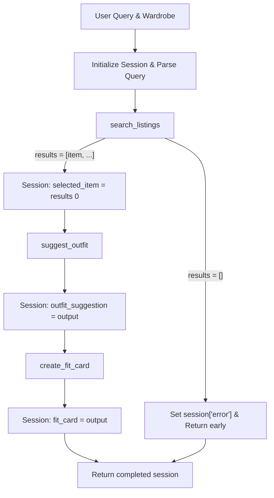

# FitFindr — planning.md

**Author:** Elaheh Baharlouei

> Complete this document before writing any implementation code.
> Your spec and agent diagram are what you'll use to direct AI tools (Claude, Copilot, etc.) to generate your implementation — the more specific they are, the more useful the generated code will be.
> Your planning.md will be reviewed as part of your submission.
> Update it before starting any stretch features.

---

## Tools

### Tool 1: search_listings

**What it does:**
Searches a local dataset to find secondhand clothing items that match the user's keyword description, size, and price limits. The backend for this is implemented in Google Colab using Hugging Face models and the FAISS library for similarity matching.

**Input parameters:**
- `description` (str): The natural language description of the clothing item (e.g., "vintage graphic tee").
- `size` (str | None): The specific size requested by the user, extracted from the query.
- `max_price` (float | None): The maximum budget extracted from the query (e.g., 30.0).

**What it returns:**
A list of dictionaries (`list[dict]`). Each dictionary represents a matched item and contains fields like: `title`, `price`, `size`, `condition`, `platform`, and `description`.

**What happens if it fails or returns nothing:**
If no items match the exact criteria, it returns an empty list `[]`. The planning loop catches this, halts execution before calling the LLMs, and returns an error asking the user to broaden their search.

---

### Tool 2: suggest_outfit

**What it does:**
Calls the Groq LLM API to cross-reference the newly found item with my existing digital wardrobe to recommend a cohesive outfit.

**Input parameters:**
- `new_item` (dict): The selected item dictionary returned by `search_listings`.
- `wardrobe` (dict): The user's existing closet data loaded from a JSON file.

**What it returns:**
A string containing personalized styling advice and specific outfit pairings.

**What happens if it fails or returns nothing:**
If I select the "Empty Wardrobe" option, the tool detects the empty array, alters the LLM prompt to ignore wardrobe matching, and instead generates general styling tips for the item so the app doesn't crash.

---

### Tool 3: create_fit_card

**What it does:**
Calls the Groq LLM API to generate a short, natural-sounding social media caption that incorporates both the outfit details and the new item's price and platform.

**Input parameters:**
- `outfit` (str): The generated styling advice returned by `suggest_outfit`.
- `new_item` (dict): The selected item dictionary returned by `search_listings`.

**What it returns:**
A string containing the formatted social media caption.

**What happens if it fails or returns nothing:**
If the `outfit` input string is missing or empty, the tool bypasses the Groq API call entirely to save resources and returns a hardcoded error: "Could not generate fit card: outfit details missing."

---

## Planning Loop

**How does your agent decide which tool to call next?**
The loop uses conditional branching logic:
1. Parse the query using regex to extract explicit `size` and `max_price` parameters.
2. Call `search_listings(description, size, max_price)`.
3. Check the result. **If the result is empty:** set `session["error"] = "No matching items found."` and return the session early.
4. **If the result has items:** set `session["selected_item"] = results[0]` and proceed.
5. Pass the saved item and the user's wardrobe to `suggest_outfit`. Save the output to `session["outfit_suggestion"]`.
6. Pass the suggestion and the saved item to `create_fit_card`. Save the output to `session["fit_card"]`.
7. Return the completed session dictionary.

---

## State Management

**How does information from one tool get passed to the next?**
State is tracked entirely within a single `session` dictionary initialized at the start of the interaction. Tools do not pass data directly to each other. Instead, a tool returns its output to the planning loop, the loop saves it into the `session` dictionary (e.g., `session["selected_item"]`), and then the loop passes that saved state into the next tool as an input parameter.

---

## Error Handling

| Tool | Failure mode | Agent response |
|------|-------------|----------------|
| search_listings | No results match the query | Catches the empty list `[]`, halts the pipeline, and returns: "I couldn't find any items matching those exact criteria. Try increasing your budget or adjusting the description." |
| suggest_outfit | Wardrobe is empty | Detects the empty array, alters the LLM prompt to ignore wardrobe matching, and provides general styling tips for the item instead. |
| create_fit_card | Outfit input is missing or incomplete | Detects the empty string, bypasses the Groq API call entirely, and returns: "Could not generate fit card: outfit details missing." |

---

## Architecture

## AI Tool Plan

** Milestone 3 — Individual tool implementations:
I will use Claude/Gemini as a syntax reference and debugging partner. For suggest_outfit and create_fit_card, I will write the tool structures myself and use the AI to help properly format the specific Groq API JSON payloads based on my wardrobe_schema.json. Before integrating any syntax it suggests, I will verify it is using an active model (like llama-3.3-70b-versatile) and manually test my "empty wardrobe" fallback logic in the terminal to ensure it works. For search_listings, I will implement the Hugging Face and FAISS logic locally in Colab and use AI only if I run into library-specific errors.

** Milestone 4 — Planning loop and state management:
I will build the run_agent() conditional loop myself based on my Mermaid diagram. I will use the AI primarily to review my code for state management leaks or to help brainstorm how to structure the regex for parsing user queries. I will manually write and inject the re.search() parser at the top of the loop and test the early exit conditions myself to ensure the data flows exactly as I planned without taking over control.

A Complete Interaction (Step by Step)
Example user query: "I'm looking for a vintage graphic tee under $30. I mostly wear baggy jeans and chunky sneakers. What's out there and how would I style it?"

Step 1:
The agent parses the query, extracts max_price: 30, and leaves description: "vintage graphic tee". It calls search_listings("vintage graphic tee", None, 30.0). It finds a match and returns [{'title': 'Y2K Baby Tee', 'price': 25, ...}]. The loop saves this to session["selected_item"].

Step 2:
The loop calls suggest_outfit(session["selected_item"], wardrobe). The Groq LLM analyzes the closet and returns: "Pair the Y2K Baby Tee with your baggy jeans and chunky sneakers for a relaxed 90s streetwear look." The loop saves this to session["outfit_suggestion"].

Step 3:
The loop calls create_fit_card(session["outfit_suggestion"], session["selected_item"]). The Groq LLM returns a caption: "Just snagged this Y2K Baby Tee for $25! Styling it with my baggy jeans and chunky sneakers for ultimate comfort. #OOTD #Vintage". The loop saves this to session["fit_card"].

Final output to user:
The UI populates all three panels: Panel 1 shows the Y2K Baby Tee details, Panel 2 shows the outfit suggestion, and Panel 3 shows the generated social media caption.